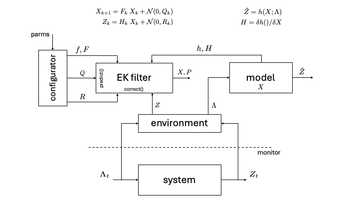

# model-tuner

Tuner of queueing model parameters using Extended Kalman Filter.

## High-level architecture


**Note:** The model tuner can be used as a standalone tuner for any model, not necessarily a queueing model, with the user plugging in their own observation function with template `func observationFunc(x *mat.VecDense) *mat.VecDense {}` in file `pkg/core/tuner.go`.
The user would also need to provide a config file to initialize the tuner. 

## Observers

The Tuner can use four different observers — Simulated, Offline, and Online Observer.
### Simulated Observer
The `SimulatedObserver` generates synthetic metrics, particularly queue wait time and token service time, for a state-dependent queueing model. It uses predefined input parameters such as arrival rate, average number of tokens, and service rate coefficients, and introduces controlled noise to mimic real-world variability in system behavior. An example program is provided in `demos/simulated-observer`.

### Offline Observer
The `OfflineObserver` reads environment metrics from a CSV file to simulate system behavior. Each row in the file corresponds to a time step and provides values for arrival rate, average tokens per request, batch size, average queue time, and token service time. It is useful for offline experimentation and replaying real or synthetic data traces. The observer returns these values sequentially on each call to `GetEnvironment()`.
An example CSV file is provided, containing data collected from an experiment conducted on an OpenShift cluster with an A100 GPU, using the vLLM production stack to serve the facebook/opt-125m model with a single running instance.  An example program is provided in `demos/offline-observer`.

### Online Observer
The `OnlineObserver` collects live environment metrics from a Prometheus server. It queries values such as request rate, average tokens per request, batch size, queue wait time, and token service time using custom Prometheus queries. 

**Configuration:**
To use the OnlineObserver, the following environment variables must be set:
* `TOKEN`: A bearer token for authenticating with Prometheus (if required).
* `PROMETHEUS_ADDRESS`: The full URL to the Prometheus server.

The Prometheus queries are parameterized and can be configured by changing:
* `namespace`: The Kubernetes namespace (default: "platform-opt").
* `modelName`: A substring or regex pattern to identify the model (default: "opt-125").
* `duration`: Query range window (default: "1m").

These parameters can be customized within the code or exposed for external configuration as needed. 
On each call to `GetEnvironment()`, the observer queries Prometheus for the latest values and returns a fully populated Environment struct, enabling dynamic system monitoring and online tuning.  An example program is provided in `demos/online-observer`.

## Tuner Service
The TunerService maintains a list of tuners, where each tuner is associated with an inference server.
The `TunerServer` exposes an HTTP API (`/getparams`) to return the parameters of a server's queueing model when asked. 
It also leverages the `Inferno`'s  collector as the observer to gather real-time environment metrics.

**Features**
1. REST API Endpoint: `GET /getparams?server_name=<name>` returns the tuned parameters (`alpha` and `beta`) for a specific server.
Responds with:
```
  "server_name": "your-server",
  "alpha": 0.14,
  "beta": 0.08
```
2. Periodic Tuning Loop: If configured with a tuning period, the service runs a background loop that:
    * Periodically collects environment metrics via the `\getenv` API call to `Inferno`'s collector.
    * Updates each server's model parameters `alpha` and `beta` based on the environment obtained from collector.

**Configuration**
1. The environement variables `TUNER_HOST`, `TUNER_PORT`, `COLLECTOR_HOST` and `COLLECTOR_PORT` can be set by running `source setparams.sh`. The script `setparams.sh` can be found [here](https://github.ibm.com/ai-platform-research/inferno/tree/main/services/scripts)
2. The tuning interval is defined via the `tunerPeriod` parameter (in seconds).  


