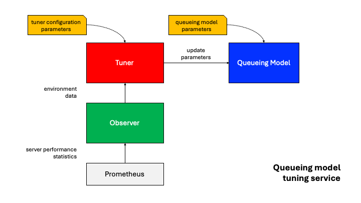
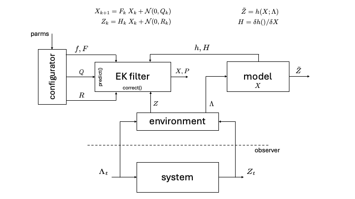

# model-tuner

The model tuner dynamically updates the parameters of the queueing model based on observations, using an Extended Kalman Filter.



## High-level architecture


**Note:** The model tuner can be used as a standalone tuner for any model, not necessarily a queueing model, with the user plugging in their own observation function with template `func observationFunc(x *mat.VecDense) *mat.VecDense {}` in file `pkg/core/tuner.go`.
The user would also need to provide a config file to initialize the tuner.

## Observers

The Tuner can use four different observers — Simulated, Offline, Online, and Data Observer.

### Simulated Observer

The `SimulatedObserver` generates synthetic metrics, particularly queue wait time and token service time, for a state-dependent queueing model. It uses predefined input parameters such as arrival rate, average number of tokens, and service rate coefficients, and introduces controlled noise to mimic real-world variability in system behavior. An example program is provided in `demos/simulated-observer`.

### Offline Observer

The `OfflineObserver` reads environment metrics from a CSV file to simulate system behavior. Each row in the file corresponds to a time step and provides values for arrival rate, average tokens per request, batch size, average queue time, and token service time. It is useful for offline experimentation and replaying real or synthetic data traces. The observer returns these values sequentially on each call to `GetEnvironment()`.
An example CSV file is provided, containing data collected from an experiment conducted on an OpenShift cluster with an A100 GPU, using the vLLM production stack to serve the facebook/opt-125m model with a single running instance.  An example program is provided in `demos/offline-observer`.

### Online Observer

The `OnlineObserver` collects live environment metrics from a Prometheus server. It queries values such as request rate, average tokens per request, batch size, queue wait time, and token service time using custom Prometheus queries.

**Configuration:**
To use the OnlineObserver, the following environment variables must be set:

* `TOKEN`: A bearer token for authenticating with Prometheus (if required).
* `PROMETHEUS_ADDRESS`: The full URL to the Prometheus server.

The Prometheus queries are parameterized and can be configured by changing:

* `namespace`: The Kubernetes namespace (default: "platform-opt").
* `modelName`: A substring or regex pattern to identify the model (default: "opt-125").
* `duration`: Query range window (default: "1m").

These parameters can be customized within the code or exposed for external configuration as needed.
On each call to `GetEnvironment()`, the observer queries Prometheus for the latest values and returns a fully populated Environment struct, enabling dynamic system monitoring and online tuning.  An example program is provided in `demos/online-observer`.

## Tuner Service

The `tunerservice` package is a passive HTTP server designed for integration with the llm-inferno control-loop. It accepts per-replica metrics from the Collector, runs parameter tuning grouped by `(model, accelerator)`, and returns updated `ModelData` (alpha, beta, gamma) ready for direct use by the Optimizer — no internal polling loop or Collector dependency.

**Key endpoints:**
- `POST /tune` — accepts `[]config.ServerSpec`, runs tuning, stores results in `ParameterStore`
- `POST /merge` — accepts current `config.ModelData`, returns it with tuned `PerfParms` overlaid from `ParameterStore`
- `GET /getparams?model=<name>&accelerator=<acc>` — retrieves the last stored parameters for a pair
- `GET /warmup` — returns whether any pair is still in warm-up (collection, EKF warm-up, or SWNM window-filling phase)

**Two estimation backends** — select via `TUNER_ESTIMATOR_MODE`:
- `ekf` (default) — Extended Kalman Filter with NIS-gate outlier rejection
- `sliding-window` — re-fits [α,β,γ] via Nelder-Mead every cycle over a FIFO window of recent observations (`TUNER_WINDOW_SIZE`, default 10); no covariance matrices to tune; includes residual-based outlier rejection (`TUNER_RESIDUAL_THRESHOLD`, default 0.5). Use this when the EKF diverges or NIS-gate misfires produce bad parameter estimates.

**Initial parameter estimation** — before steady-state begins for a new `(model, accelerator)` pair, the service accumulates `TUNER_INIT_OBS` (default 5) observations across control cycles, then runs a Nelder-Mead fit to find initial (α, β, γ) that jointly explain all observations. During collection, `GET /warmup` returns `true` (configurable via `TUNER_INIT_HOLD_BACK`) so the controller can defer optimization until parameters are ready.

See [`tunerservice/README.md`](tunerservice/README.md) for full API docs, EKF features, warm-up phases, and configuration.

## Running the Tuner Service

### Standalone

Run directly with Go from the repo root:

```bash
go run ./demos/tunerservice
```

The server listens on `localhost:8081` by default. Override with environment variables:

```bash
TUNER_HOST=0.0.0.0 TUNER_PORT=9090 go run ./demos/tunerservice
```

Config is loaded from `config-data/` by default. Override with:

```bash
CONFIG_DATA_DIR=/path/to/configs go run ./demos/tunerservice
```

### Container

**Build the image:**

```bash
docker build -t inferno-model-tuner:latest .
```

**Run the container:**

```bash
docker run --rm -p 8081:8081 inferno-model-tuner:latest
```

The server binds to `0.0.0.0:8081` inside the container and is reachable at `http://localhost:8081` on the host.

**Override config at runtime** by mounting a directory and setting `CONFIG_DATA_DIR`:

```bash
docker run --rm -p 8081:8081 \
  -v /path/to/your/configs:/etc/tuner/config \
  -e CONFIG_DATA_DIR=/etc/tuner/config \
  inferno-model-tuner:latest
```

### Kubernetes

The `deploy/` directory contains ready-to-apply manifests.

**Apply all resources** (ConfigMap + Deployment + Service):

```bash
kubectl apply -f deploy/
```

This creates:
- `model-tuner-config` — ConfigMap with default EKF configuration
- `model-tuner` — Deployment (1 replica, image `quay.io/atantawi/inferno-model-tuner:latest`)
- `model-tuner` — ClusterIP Service reachable at `http://model-tuner:8081` within the cluster

**Override config** by replacing the ConfigMap data or mounting a custom ConfigMap and setting `CONFIG_DATA_DIR` in the Deployment's env.

**Check the server is running:**

```bash
kubectl get pods -l app=model-tuner
kubectl logs -l app=model-tuner
```
